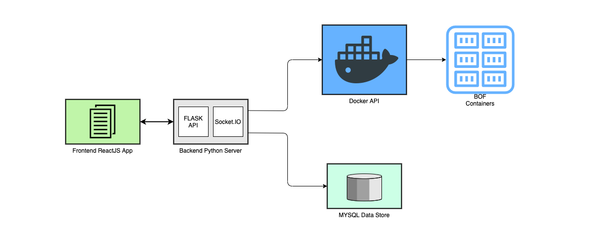

## Architecture

This document provides an overview of the Capture The Flag (CTF) Architecture. The objective of this application is to let a user host a CTF style competition consisting of different teams. The application is designed to let the user choose different Computer Security modules like Buffer Overflow, Format String vulnerable services that the teams can attack and plant a flag. In this specific application we host the vulnerable service in a container consisting of a secret file that the team needs to access. Once the team gets access to this secret file consisting of the string they can send to the CTF server to verify its correctness and win the round.

### Frontend ReactJS App

The frontend application is built using ReactJS. There are 2 parts to the frontend:
- Admin page -  used to create / manage the teams along with hosting different vulnerable services for different teams. 
- Monitor page - This is used to show the overall status of different teams in the competition. There are two views, one is a condensed version with minimal information of the teams and the other version includes more details like the vulnerable service port number for each team. 

### Backend Python Server

The backend server uses Flask as the API Service and Socket.IO for real time updates. 

Flask API service is used to manage the application. 
- Teams API - This is used to manage the teams 
- Session API - This is used to create/manage the containers used to run the vulnerable services for each team. 

Socket.io provides the teams with real time log access of the docker containers. It also notifies the clients when a team successfully captures the flag. 

### Buffer Overflow Attack Module

In this module we run a vulnerable server in the docker container. The containers are managed by the backend python server which connects to the Docker API service. Each container is started at different levels from level 1 to 4 - with different BOF server parameters. The container is initialized with a unique secret string stored at the `/tmp/pasfile` during the start of the session. The team assigned to the session needs to attack the BOF server and obtain the unique secret string which needs to be then printed to the stdout of the BOF server. 

